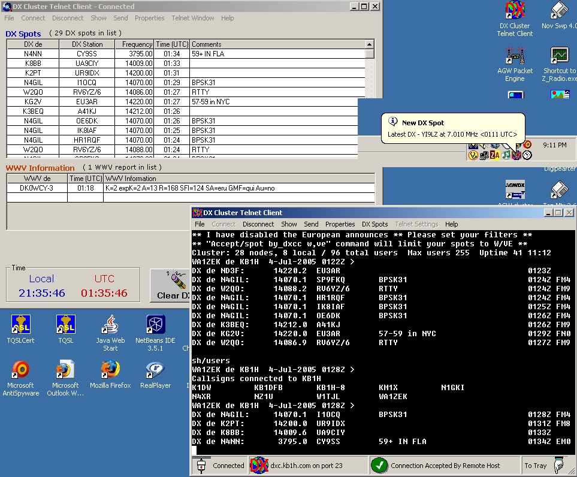



## Ham Radio DX Cluster Telnet Client

### Description

March 2006. Update that fixes some resize problems with the DX window form. Telnet client for Ham Radio DX Clusters. Log into your local DX Cluster via telnet. DX spots and WWV spots are put into table form. Many features including tunning your radio (Kenwood only for now). This app is complete and fuctional, only missing support for non-Kenwood radios. See HTML docs in the ZIP file for features. I do not have any plans to develope this beyond this point, might add other radio types (ICOM, Yeasu, Ten-Tec) as I have time and acquire these radios myself. So I am posting it here and hope some find it usefull. Take it and go play. 73 de WA1ZEK / VK2IFH
 
### More Info
 

             |
---                |---
**Submitted On**   |2006-03-05 18:25:14
**By**             |[Mark Mokoski](https://github.com/Planet-Source-Code/PSCIndex/blob/master/ByAuthor/mark-mokoski.md)
**Level**          |Intermediate
**User Rating**    |5.0 (20 globes from 4 users)
**Compatibility**  |VB 6\.0
**Category**       |[Miscellaneous](https://github.com/Planet-Source-Code/PSCIndex/blob/master/ByCategory/miscellaneous__1-1.md)
**World**          |[Visual Basic](https://github.com/Planet-Source-Code/PSCIndex/blob/master/ByWorld/visual-basic.md)
**Archive File**   |[Ham\_Radio\_197804352006\.zip](https://github.com/Planet-Source-Code/mark-mokoski-ham-radio-dx-cluster-telnet-client__1-61467/archive/master.zip)

